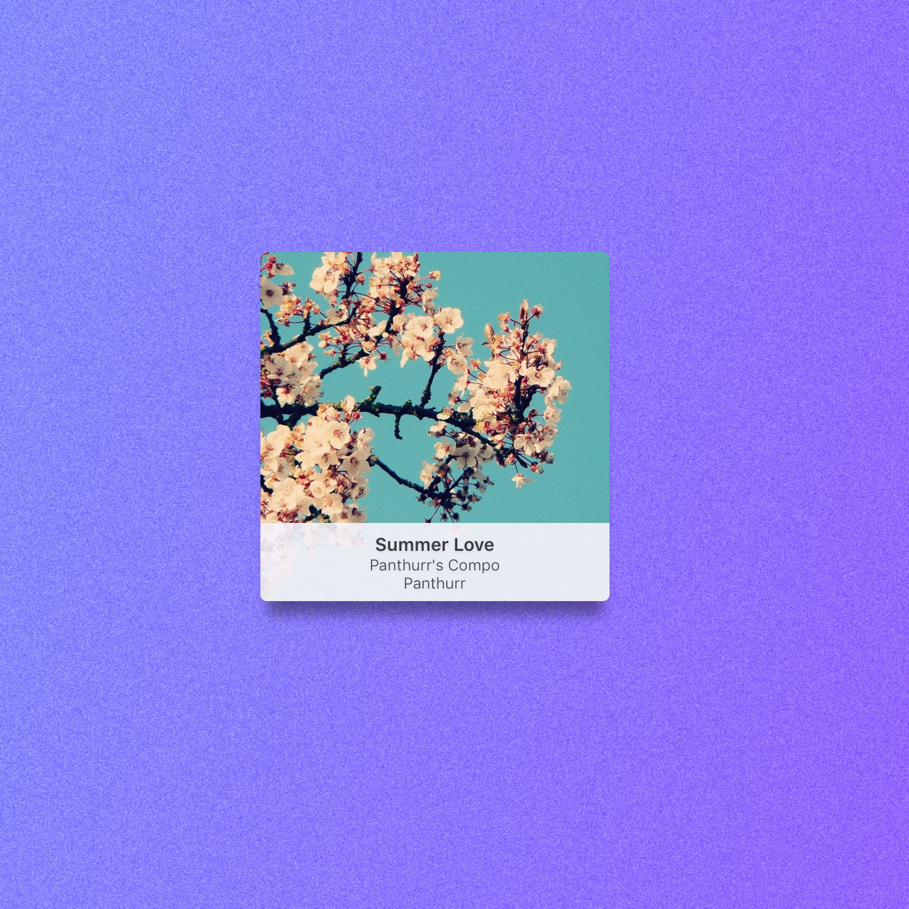
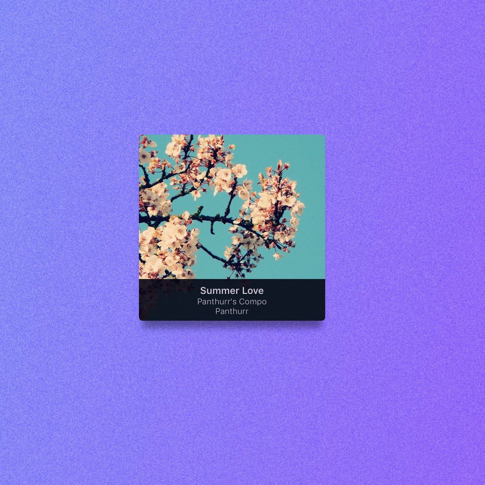

# MinimalTheme

Widget for the [Swinsian app.](https://swinsian.com)

### Installation
* Download the [latest release](https://github.com/Oloar/Minimaltheme/releases/latest)
* Decompress it in your application configuration folder at `~/Library/Application Support/Swinsian/Themes/`

### Themes
#### Light

#### Dark

#### Cover only

